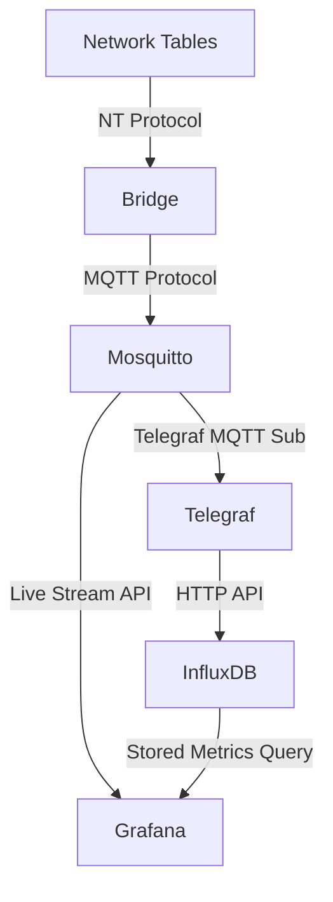

# nt2mqtt
WPILib FRC Network Tables to MQTT

## Goals

- Stream live data from the robot to Grafana during test/practice
  - Useful for troubleshooting and testing
  - Same data being sent to the dashboard
- Store data for later analysis
  - Lower-resolution version of the streaming data
  - Use Grafana for post-match analysis of critical systems and sensors
  - Time syncronization to correlate data with points during the match

## Overview

The general flow is as follows:

