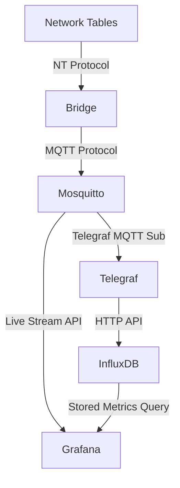

# nt2mqtt
WPILib FRC Network Tables to MQTT

## Goals

- Stream live data from the robot to Grafana during test/practice
  - Useful for troubleshooting and testing
  - Same data being sent to the dashboard
- Store data for later analysis
  - Lower-resolution version of the streaming data
  - Use Grafana for post-match analysis of critical systems and sensors
  - Time syncronization to correlate data with points during the match
  - Leverage Grafana annotations API to highlight segment of data during the match(?)

## Overview

The general flow is as follows:

## Reference Links

- Streaming MQTT sensor data: https://grafana.com/blog/2021/08/12/streaming-real-time-sensor-data-to-grafana-using-mqtt-and-grafana-live/
  - MQTT data sourcehttps://grafana.com/grafana/plugins/grafana-mqtt-datasource/
- Streaming Telegraf data: https://grafana.com/tutorials/stream-metrics-from-telegraf-to-grafana/
- Annotations: https://grafana.com/docs/grafana/latest/dashboards/build-dashboards/annotate-visualizations/
  - Annotation API: https://grafana.com/docs/grafana/latest/developers/http_api/annotations/
- 